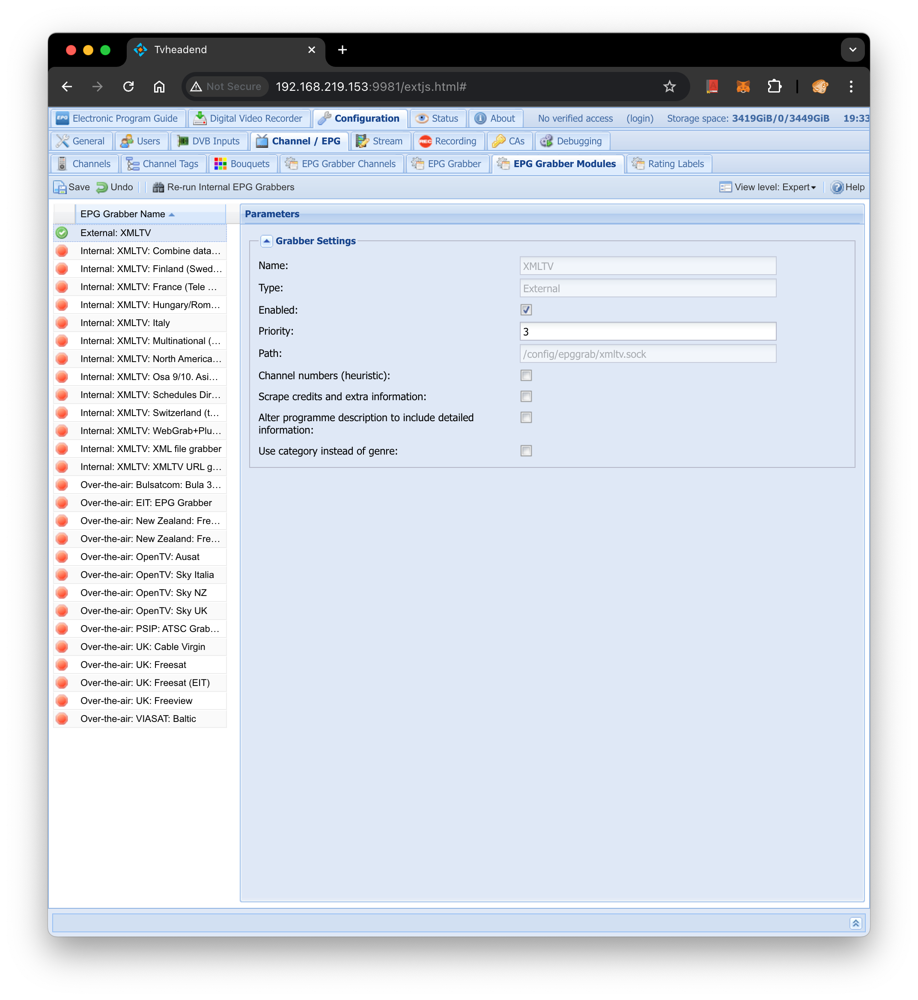
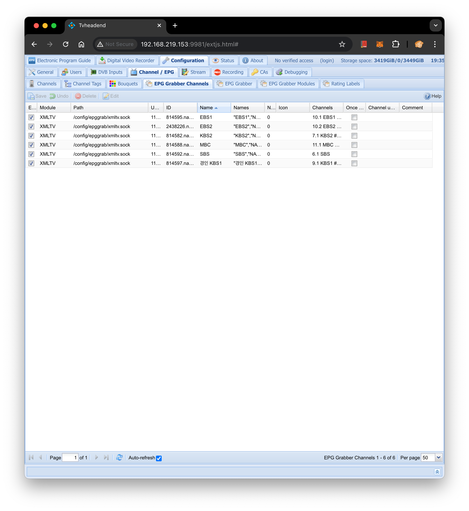

# ko-epggrab

[한국의 EPG](https://namu.wiki/w/%EC%A0%84%EC%9E%90%20%ED%94%84%EB%A1%9C%EA%B7%B8%EB%9E%A8%20%EC%95%88%EB%82%B4#s-2)는
부실하게 관리되고 있음. 일 예로, tvheadend에서 지상파의 OTA EPG를 사용하려 하면 느린 속도와 부족한 정보에 울화통이 터짐.

다행히, 웹에서 여러 업체(포털, IPTV 프로바이더)가 자체적으로 EPG를 제공하고 있고
[epg2xml](https://github.com/epg2xml/epg2xml) 를 사용하면
Tvheadend의 XMLTV EPG Grabber Module 에서 사용하는 `xmltv.xml`를 만들수 있음.

하지만, 설정과 반복실행을 자동화 하기가 힘든점이 어려웠음.

ko-epggrab 은 epg2xml의 채널 목록을 json 설정 파일, `epg2xml.json`
에 채워 넣는 과정과 주기적인 실행을 단순, 자동화 하고 Tvheadend로 부터 분리하기 위해 만들었으며
다음의 기능이 있음:
- EPG 프로바이더, 카테고리별 채널 선택
- 채널 이름의 allow list 필터링
- 주기적인 채널 목록 갱신 (기본값: 1주일에 한 번)
- 주기적인 EPG 생성 및 UDS 푸시 (기본값: 12시간마다)


## 도커 이미지로 실험해 보기

채널 목록을 패치하고(`-fc`) 채널 목록을 Yaml 포멧으로 프로바이더와 카테고리별로 나열(`-lc`) :
```sh
mkdir epg2xml_conf
docker pull suapapa/ko-epggrab:latest
docker run \
  -it --rm -v $(pwd)/epg2xml_conf:/conf \
  suapapa/ko-epggrab:latest \
    -fc -lc
```

Docker-Compose 로 tvheadend와 함께 사용하는 예제:
```yaml
services:
  tvheadend:
    image: lscr.io/linuxserver/tvheadend:latest
    container_name: tvheadend
    environment:
      - PUID=0
      - PGID=0
      - TZ=Asia/Seoul
    volumes:
      - /system/tvheadend/config:/config # tvheadend의 설정 디렉터리
      - /data/recording/tvheadend:/recordings
    network_mode: "host"
    devices:
      - /dev/dri:/dev/dri
    restart: unless-stopped
  ko-epggrab:
    image: suapapa/ko-epggrab:latest
    container_name: ko-epggrab
    # environment:
    #   - CRON_CHANNEL_FETCH="0 0 * * 1" # 채널 목록 갱신 주기
    #   - CRON_GENERATE_XMLTV="0 */12 * * *" # xmltv.xml의 생성 및 UDS 전송 주기
    command:
      - -fc # EPG 제공업체에서 채널 목록 갱신
      - -pc # EPG 제공업체와 카테고리를 나열
      - NAVER:지상파,종합 편성;LG:홈쇼핑 # pc 옵션의 값
      - -nf # 위의 채널 목록에서 선택할 whitelist
      - 경인 KBS1,KBS2,MBC,SBS,EBS1,EBS2 # nf 옵션의 값
      - -ss # send to socket
      - -d # deamon mode
    volumes:
      - /system/tvheadend/config/epggrab:/epggrab # tvheadend 에서 마운트한 설정디레터리와 base가 같아야 서로 통신 가능
    restart: unless-stopped
```

## 참고

### TVHeadend UI 설정




### 개발 방법

epg2xml 설치:
```sh
python -m venv .venv
source .venv/bin/activate
pip install git+https://github.com/epg2xml/epg2xml.git
```

ko-epggrab 빌드:
```sh
go build
```

실행:
```sh
./epg2xml -h
```
